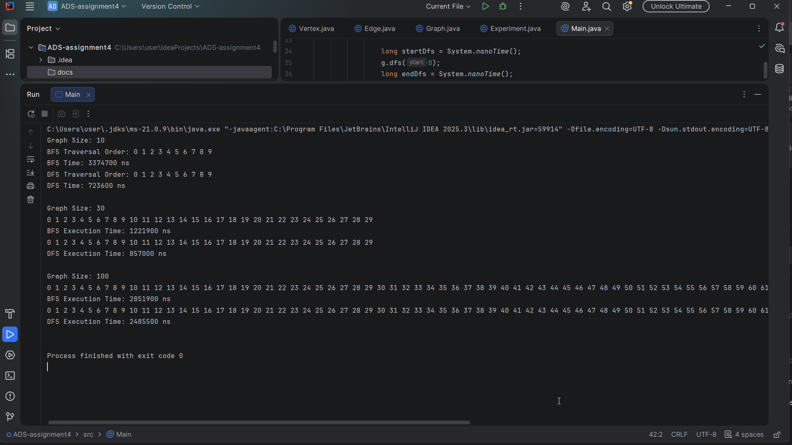

# Assignment 4

## A. Project overview
This project implements a graph data structure using an **Adjacency List**. It includes two fundamental graph traversal algorithms: **Breadth-First Search (BFS)** and **Depth-First Search (DFS)**. The goal is to analyze their performance across different graph sizes (10, 30, and 100 vertices).

*   **Vertices:** Represent nodes in the graph, each identified by a unique ID.
*   **Edges:** Represent connections between two vertices (Source -> Destination).

## B. Class descriptions
*   **Vertex:** A simple class that stores a unique identifier for each node.
*   **Edge:** Represents a directed connection between two vertices.
*   **Graph:** The core class that manages vertices and edges using a `HashMap<Integer, List<Integer>>` as an adjacency list. It contains the implementation for BFS and DFS.
*   **Experiment:** A utility class to automate the creation of graphs and measure execution times.

## C. Algorithm descriptions

### Breadth-First search (BFS)
*   **Step-by-step:** Uses a `Queue` to visit all neighbors of a node before moving to the next level. It marks nodes as visited to avoid cycles.
*   **Use cases:** Finding the shortest path in unweighted graphs, GPS navigation.
*   **Time Complexity:** O(V + E), where V is vertices and E is edges.

### Depth-first search (DFS)
*   **Step-by-step:** Uses recursion (system stack) to go as deep as possible along a branch before backtracking.
*   **Use cases:** Topological sorting, solving puzzles (like mazes), cycle detection.
*   **Time Complexity:** O(V + E).

## D. Experimental results

| Graph Size | BFS Time (ns) | DFS Time (ns) |
|------------|---------------|----|
| 10 nodes   | [3374700]     | [723600] |
| 30 nodes   | [1221900]     | [857000] |
| 100 nodes  | [2851900]     | [2485500] |

### Observations and patterns
*   As the number of vertices and edges increases, the execution time for both algorithms grows linearly, confirming the O(V + E) complexity.
*   Graph structure significantly affects the order: BFS visits level by level, while DFS explores deep paths first.

## E. Analysis questions
1.  Performance decreases as size increases because more nodes and edges need to be processed.
2.  usually BFS and DFS are very close.
3.  Yes, the time growth correlates with the increase in nodes and edges.
4.  When you need to find the shortest path or nodes nearby.
5.  It can lead to a `StackOverflowError` on very deep graphs and doesn't find the shortest path.

## F. Reflection
During this assignment, I learned how to represent graphs efficiently using adjacency lists. I understood the practical differences between BFS and DFS and how to measure algorithm performance in Java. The main challenge was ensuring the graph remains consistent while adding edges between randomly generated vertices.

